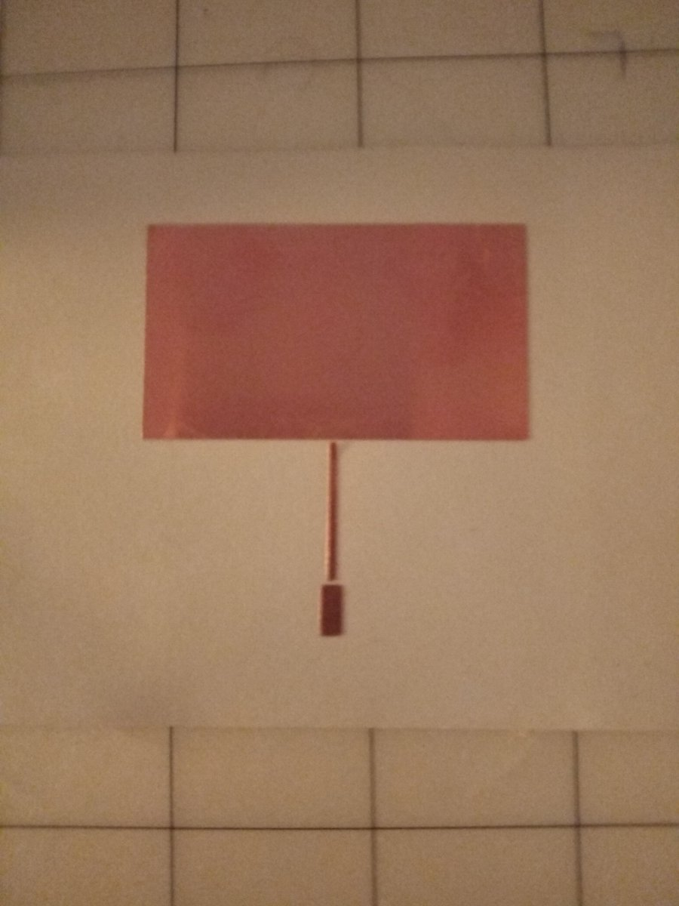

## footprint

Create KiCad footprints using Python 3.


The library provides the following methods:

```
footprint.__init__(name='name', center=(0,0), board=(0,0), flip=False)
   - 'board' sets the size of the board
   - 'center' sets the center point of the footprint
   - 'name' sets the name of the footprint
   - 'flip' if true flips board around y axis (y' = board[1] - y)

footprint.poly(points, origin=(0,0), layer='F.Cu')
   - draw a filled polygon using the points listed in 'points'
   - 'origin' sets the starting corner of the rectangle
   - 'layer' sets the KiCad PCB layer 

footprint.rect(size, origin=(0,0), layer='F.Cu')
   - draw a filled rectangle using a polygon
   - 'origin' sets the starting corner of the rectangle
   - 'layer' sets the KiCad PCB layer 

footprint.edge(size, origin=(0,0), width=0.15, layer='Edge.Cuts')
   - draw a unfilled rectange using lines
   - 'origin' sets the starting corner of the rectangle
   - 'width' sets the width of the line along the rectangle
   - 'layer' sets the KiCad PCB layer 

footprint.via(pos, origin=(0,0), size=(1,1), drill=0.5, pad=1)
   - create a via at pos + origin
   - 'size' sets the size of the via
   - 'drill' sets the size of the drill hole
   - 'pad' sets the type of the via

footprint.write()
   - print the KiCad footprint to stdout
```

For example, the following is a 2.4GHz BLE inverted F antenna.  The dimensions
were taken from the NXP Antenna Design Guide, page 15.


```python
"""
       1mm _
         |  |
         |  |
         |  |
         |  18.2mm
         |  |
         |  |
         | _|
=========| __
         |  |
         |  5.4mm 
         | _|
=========|
h = 4.4mm
"""

from footprint import Footprint

def build(fp):
    # BLE Antenna Design Guide, NXP Semiconductors, p15
    fp.rect((-4.4, 1), origin=(4.4, 3))
    fp.rect((-4.4, 1), origin=(4.4, 3 + 1 + 5.4))
    fp.rect((1, 1 + 5.4 + 1 + 18.2), origin=(4.4, 3))
    fp.write()

board = (0, 32)
center = (board[0] / 2, board[1] / 2)
fp = Footprint(center=center, board=board, flip=True)
build(fp)
```


or


```python
"""
         | --
         |  |
         |  |
         |  18.2mm
         |  |
         |  |
4.4mm    | _|
=========| __
         |  |
         |  5.4mm 
         | _|
=========|
        1mm
"""

from footprint import Footprint

def build(fp):
    w = 4.4
    h = 1 + 5.4 + 1 + 18.2
    fp.poly([(0, 0), (w + 1, 0), (w + 1, h),
             (w, h), 
             (w, 2 + 5.4), 
             (0, 2 + 5.4),
             (0, 1 + 5.4),
             (w, 1 + 5.4),
             (w, 1),
             (0, 1)])
    fp.write()

build(Footprint(flip=True))
```


Next is a 2.4GHz patch antenna created using
the patch16.exe DOS program by WB0DGF.  A full PCB
is created by the following code.  


```python
# 2.4GHz Patch

from footprint import Footprint

def build(fp):

    board = fp.board
    corner = (-board[0]/2, -board[1]/2)

    # add border to all layers
    fp.edge(board, origin=corner, layer='Edge.Cuts')
    fp.edge(board, origin=corner, layer='F.Mask')
    fp.edge(board, origin=corner, layer='B.Mask')
    fp.edge(board, origin=corner, layer='F.Cu')
    fp.edge(board, origin=corner, layer='B.Cu')

    # ground plane on back
    fp.rect(board, origin=corner, layer='B.Cu')

    # solder mask for SMA edge connector
    fp.rect((8, -4), origin=(-4, board[1]/2), layer='F.Mask')
    fp.rect((8, -4), origin=(-4, board[1]/2), layer='B.Mask')

    # patch
    l = 27.2   # length of patch
    w = 50.8   # width of patch
    fp.rect((w, l), origin=(-w/2, -l/2))

    # hi-Z quarter wave line
    h = 1.58   # dieletric (Er=4.2) height, ie 1/16"
    dl = 18    # length of quarter wave line
    dw = 1.3   # width of quarter wave line
    zw = 3.1   # width of 50 ohm line
    lh = .44   # open-circuit extension (l/h) of the 50 ohm line (from Puff book p37)
    lsh = lh * (1 - dw / zw)  
    ext = h * lsh
    dl += ext
    fp.rect((dw, dl), origin=(-dw/2, l/2))

    # 50 ohm line
    d = l/2 + dl
    zl = board[1]/2 - d
    fp.rect((zw, zl), origin=(-zw/2, d))
    fp.write()


build(Footprint(board=(100, 80)))
```


The simpliest way
to import this PCB (or other footprints) into KiCad
is to first run Pcbnew, click open footprint
editor, in the editor click import footprint, and
lastly click insert footprint into current board.
Go back to Pcbnew and find the footprint at 0,0 in the 
upper left hand corner. 

The file 'patch.svg' was created by printing the F-Cu layer
only of the footprint in Pcbnew.  The result was then modified
in Inkscape: first changing the bounding box, removing
the fill from the rectangles and lastly unioning the result
to remove the line crossings.


Cutting the SVG file (without the unioning) on copper foil tape with a vinyl cutter gave the following:
(The cuts that cross the foil were the result of me forgetting to "union" the paths in inkscape before 
printing).




