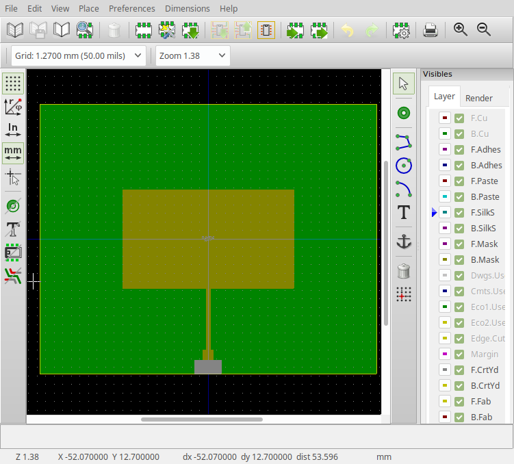

## footprint

Create kicad footprints using python 3.

The library provides the following methods:

```
footprint.__init__(name='name', center=(0,0), board=(0,0))
   - 'board' sets the size of the board (used by 'flip')
   - 'center' sets the center point of the footprint
   - 'name' sets the name of the footprint

footprint.rect(size, origin=(0,0), layer='F.Cu', flip=False)
   - draw a filled rectangle using a polygon
   - 'origin' sets the starting corner of the rectangle
   - 'layer' sets the kicad PCB layer 
   - setting 'flip' flips the Y axis

footprint.edge(size, origin=(0,0), width=0.15, layer='Edge.Cuts')
   - draw a rectange using lines
   - 'origin' sets the starting corner of the rectangle
   - 'width' sets the width of the line along the rectangle
   - 'layer' sets the kicad PCB layer 

footprint.via(pos, origin=(0,0), size=(1,1), drill=0.5, pad=1)
   - create a via at pos + origin
   - 'size' sets the size of the via
   - 'drill' sets the size of the drill hole
   - 'pad' sets the type of the via

footprint.write()
   - print the kicad footprint to stdout

```

For example, the following is a 2.4GHz BLE inverted F antenna.  The dimensions
were taken from the NXP Antenna Design Guide, page 15.

```
from footprint import Footprint
board = (0, 32)
center = (board[0]/2, board[1]/2)
fp = Footprint(center=center, board=board)
fp.rect((-4.4, 1), origin=(4.4, 3), flip=True)
fp.rect((-4.4, 1), origin=(4.4, 3 + 1 + 5.4), flip=True)
fp.rect((1, 1 + 5.4 + 1 + 18.2), origin=(4.4, 3), flip=True)
fp.write()
```


Next is a 2.4GHz patch antenna created using
the patch16.exe DOS program by WB0DGF.  A full PCB
is created by the following code.  

The simpliest way
to import this PCB (or other footprints) into Kicad
is to first run Pcbnew, click open footprint
editor, in the editor click import footprint, and
lastly click insert footprint into current board.
Go back to Pcbnew and find the footprint at 0,0 in the 
upper left hand corner. 

```
from footprint import Footprint

l = 29.2   # length of patch
w = 50.8   # width of patch
dl = 18    # length of quarter wave line
dw = 1.3   # width of quarter wave line
zw = 3.1   # width of 50 ohm line
h = 1.58   # dieletric (Er=4.2) height, ie 1/16"
ext = .44  # open-circuit extension (l/h) of 50 ohm line

fp = Footprint()
board = (100, 80)
ext = h * .44 * (1 - dw / zw) 

fp.edge(board, origin=(-board[0]/2, -board[1]/2), layer='Edge.Cuts')
fp.rect(board, origin=(-board[0]/2, -board[1]/2), layer='B.Cu')
fp.rect((w, l), origin=(-w/2, -l/2))
fp.rect((dw, dl + ext), origin=(-dw/2, l/2))
d = l/2 + dl + ext 
fp.rect((zw, board[1]/2 - d), origin=(-zw/2, d))
fp.write()
```



